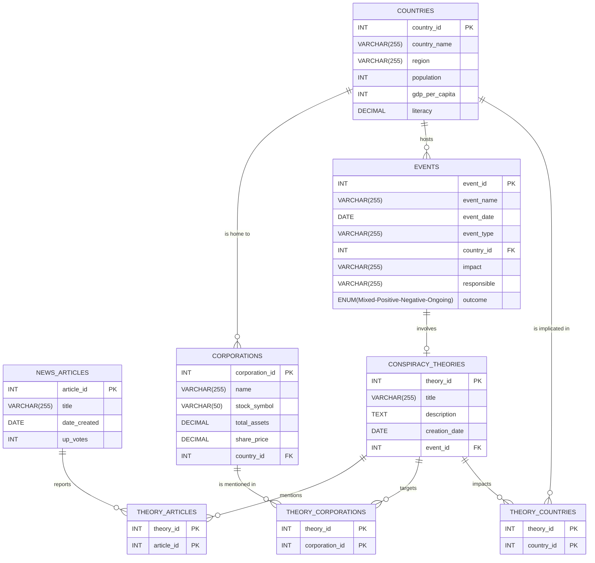

# Conspiracy Chronicles Database 🕵️‍♂️💼

Welcome to the **Conspiracy Chronicles Database**, where reality meets imagination in a whirlwind of intrigue and data! 🌍✨ This highly operational database is your gateway to a world of conspiracy theories, woven intricately with real-world facts about countries, corporations, news, and events. Here, we embrace the wildest of theories while keeping our feet firmly planted in reality—because everything you find here is real... except the theories! 🎭🔍

## Why This Database is a Game Changer

### **1. A Treasure Trove of Information**

Our database integrates rich datasets that allow you to explore a plethora of facts and figures:

- **Countries**: Get to know your nation better—population, GDP, literacy rates, and more!
- **Corporations**: Dive into the financial depths of businesses—discover their assets and stock prices!
- **News Articles**: Stay updated with the latest and greatest stories that shape our world.
- **Events**: Examine significant events that have rocked the globe and their lasting impacts.

### **2. Unleash Your Inner Detective** 🔎

Curious about the patterns that link corporations to conspiracy theories? Or perhaps you want to analyze how events in different countries shape narratives? With our expertly crafted tables and relationships, you can do just that! Each conspiracy theory is intricately connected to various entities, providing a rich tapestry for analysis.

### **3. Optimized for High Volume Queries**

Whether you're a data analyst or just a conspiracy enthusiast, this database is designed to handle high-volume queries with ease. Say goodbye to slow load times and hello to lightning-fast responses as you dig deep into the shadows of information.

### **4. Generate Your Own Conspiracies!** 🎉

Thanks to the magic of Python’s Faker library, you can populate our database with a multitude of conspiracy theories. Have fun creating narratives that intertwine with real-world events, and who knows? You might just stumble upon the next big theory!

### **5. Use Cases Galore**

- **Research**: Perfect for academic projects or curious minds wanting to explore socio-political dynamics.
- **Data Analysis**: Analyze correlations between corporate behaviors and conspiracy narratives.
- **Content Creation**: Fuel your next story or blog post with data-backed insights from real-world connections.

### Database Schema

This is the database schema for the project:

